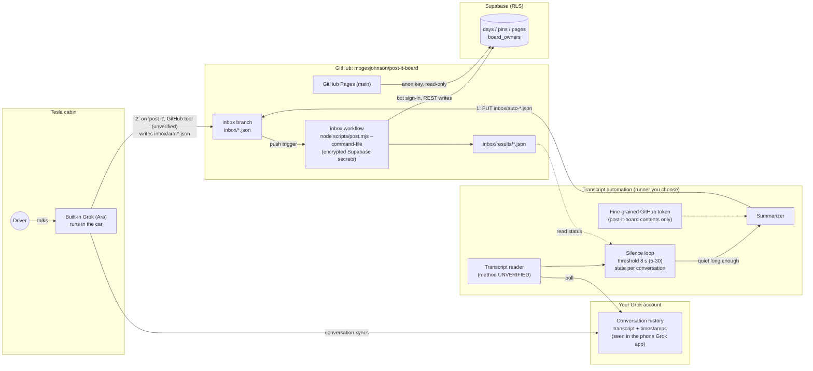
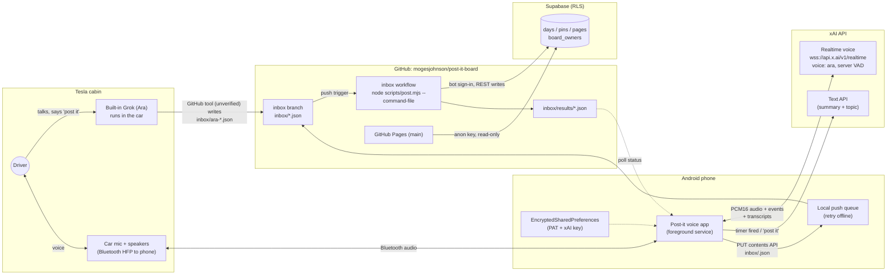
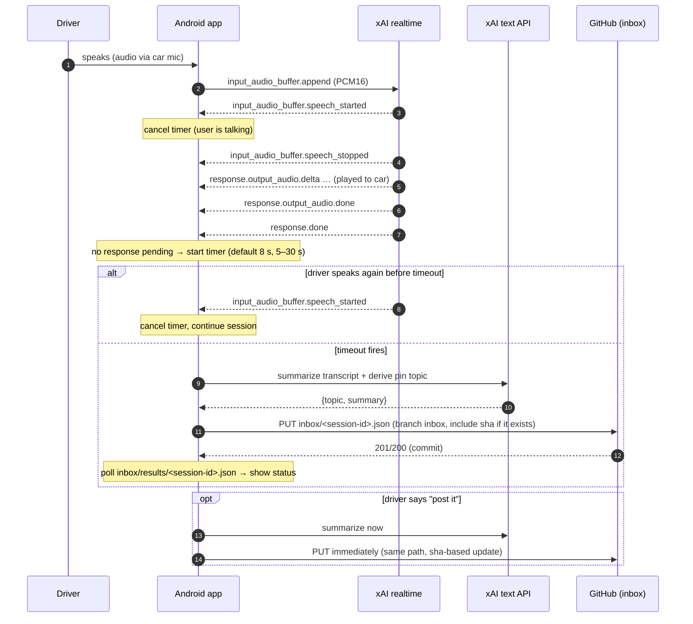

# Architecture

All write paths end in the same place: a JSON command file on the `inbox` branch of
[mogesjohnson/post-it-board](https://github.com/mogesjohnson/post-it-board), applied by GitHub Actions to
Supabase, and shown on https://mogesjohnson.github.io/post-it-board/.

| Path | Trigger | Writes | Status |
|---|---|---|---|
| **1. Transcript automation** (primary) | Newest message in the Grok transcript is older than the silence threshold (default 8 s, 5–30) | `inbox/auto-<convKey>-<ts>-<op>.json` (add, later edit) | Designed; transcript-reading method **unverified** ([transcript-automation.md](transcript-automation.md)) |
| **2. Ara "post it"** | You say "post it" in the car | `inbox/ara-<ts>-<slug>.json` | Instructions written ([ara-instructions.md](ara-instructions.md)); **untested**: assumes Ara can create files in GitHub (unverified) |
| Legacy Android voice app | Its own realtime-session timer | `inbox/<session-id>.json` | Superseded ([below](#legacy-path-custom-android-voice-app-superseded)) |

> The inbox is in **post-it-board**, not in this repo. how-to-post-it has no `inbox` branch.

## Full loop (Mermaid)



## Full loop (ASCII)

```
 PATH 1 (transcript automation)                        PATH 2 (Ara says "post it")
 ==============================                        ===========================

  Driver ──talks──▶ Built-in Grok (Ara, in the car) ──────"…post it"──────┐
                         │ conversation syncs                              │ GitHub tool (unverified)
                         ▼                                                 │ inbox/ara-<ts>-<slug>.json
              Grok history (transcript + timestamps,                       │
              visible in the phone's Grok app)                             │
                         │ read (method UNVERIFIED), every poll            │
                         ▼                                                 │
              ┌─────────────────────────────────┐                         │
              │ Transcript automation            │                         │
              │ • newest msg older than 8 s?     │                         │
              │ • state per conversation         │                         │
              │ • summarize whole conversation   │                         │
              │ • fine-grained token (contents)  │                         │
              └───────────────┬─────────────────┘                         │
                              │ PUT inbox/auto-<convKey>-<ts>-<op>.json    │
                              ▼  (add first, edit on later updates)        ▼
                    ┌───────────────────────────────────────────────────────────────┐
                    │ GitHub  mogesjohnson/post-it-board  ·  branch "inbox"          │
                    │   inbox/*.json ──push──▶ Actions "inbox" workflow              │
                    │                          node scripts/post.mjs --command-file  │
                    │   inbox/results/*.json ◀── result (status, matched, message)  │
                    └───────────────────────────────┬───────────────────────────────┘
                                                    │ bot account sign-in (RLS: board_owners)
                                                    ▼
                                     ┌──────────────────────────────┐
                                     │ Supabase  days ▸ pins ▸ pages │
                                     └──────────────┬───────────────┘
                                                    │ anon key (read-only)
                                                    ▼
                              https://mogesjohnson.github.io/post-it-board/  (GitHub Pages)
```

## Who does what

| Component | Responsibility | Not responsible for |
|-----------|----------------|---------------------|
| **Ara (built-in car Grok)** | The conversation itself. Path 2: on "post it", is meant to turn the conversation into a command file and push `inbox/ara-*.json` via a GitHub tool (**untested**: that tool is unverified). Could check `inbox/results/` | Detecting silence or posting automatically. Exposes no events to the phone |
| **Grok history / phone Grok app** | Keeps the car conversation as a transcript with timestamps | Any API we know of for reading it programmatically (**unverified**, see [transcript-automation.md §2](transcript-automation.md#2-reading-the-transcript-unverified-choose-one)) |
| **Transcript automation** | Path 1: reads recent conversations, measures quiet time, keeps state per conversation, summarizes, pushes `inbox/auto-*.json` (add, later edit), reads results, alerts on failures | Supabase credentials (it never has them). Real-time precision: it's only as fast as its poll interval |
| **GitHub inbox + Actions** | Accepts command files on `inbox`, runs `post.mjs` with encrypted repo secrets as the bot account, writes `inbox/results/<name>.json`, deletes processed commands (keeps them on `error`), serialized by a concurrency group | Deciding *what* to post; it only executes commands |
| **Supabase** | Source of truth (days/pins/pages). RLS: public read, writes only for `board_owners` (owner + bot), sign-ups off | Talking to the car, the phone or the automation directly |
| **Pages site** | Read-only corkboard UI with the anon key. The owner can sign in to edit or delete by hand | Accepting writes from the car |

## Transcript automation in brief (path 1)

Full spec: **[transcript-automation.md](transcript-automation.md)**.

- **Loop:** every poll, for each recent car conversation: newest message changed → *Active*; newest message at least
  `threshold` old (default 8 s, 5–30) and newer than the last posted one → summarize and push. If the newest
  message is yours, wait longer (Ara may still answer).
- **Clock handling:** all timestamps converted to UTC; local-only times read as America/New_York; if timestamps are
  coarse or in the future (skew), quiet time is measured by the runner's own clock since the message was first seen.
- **File names:** `inbox/auto-<sha256(conversationId)[:10]>-<last-message UTC YYYYMMDDTHHMMSSZ>.json`, pushed only if
  neither the command nor its result exists yet.
- **Continuations:** after the first `ok`, later summaries of the same conversation are `edit` commands on the same
  page (exact `pin` from `matched.pinTitle`, exact `page` title, `target: "page"`).
- **Timing:** with GitHub Actions cron (5-minute minimum) the threshold means "at least 8 s of silence, noticed at the
  next run".

---

## Legacy path: custom Android voice app (superseded)

> **Superseded, optional legacy.** Kept for reference in case the transcript can't be read reliably. The primary path
> is the [transcript automation](transcript-automation.md). Generation prompt: [ai-studio-prompt.md](ai-studio-prompt.md).

A native Android app ran its own Ara session through xAI's realtime voice API over the car's Bluetooth audio,
started a timer when Ara finished speaking, and pushed `inbox/<session-id>.json`. The proposed `sessionId`
replace semantics in `post.mjs` were never implemented; the transcript automation uses `edit` commands instead.

### App design details (legacy)

**App:** native Android, Kotlin + Jetpack Compose.

**Voice:** the app opens its own session with xAI's realtime voice API, **`wss://api.x.ai/v1/realtime`**, voice **`ara`**
([docs](https://docs.x.ai/developers/model-capabilities/audio/speech-to-speech)), with server VAD turn detection.
Audio goes through the car over Bluetooth (phone call/communication audio routing, so the car's mic and speakers are
used).

**What the API tells the app:**

| Event | Meaning for the app |
|-------|---------------------|
| `input_audio_buffer.speech_started` | you started talking → **cancel the timer** |
| `input_audio_buffer.speech_stopped` | you stopped talking |
| `response.output_audio.done` / `response.done` | Ara finished her turn → **start the timer** (if nothing else is pending) |
| input/output transcript events | both sides as text → the transcript to summarize |

**Safety-net timer**

- It starts only after Ara finishes speaking (`response.done`) **and** no response is pending (no tool call in progress, no
  queued `response.create`).
- It resets whenever you start speaking.
- **Default: 8 seconds** (your starting guess). It can be set from **5 to 30 s** in settings.
- Research suggests the built-in car Grok closes after **~15 s** of inactivity. That comes from secondary sources and is
  **unverified**. Ara can also pause while thinking, which is why the timer waits for `response.done`, not
  just silence.

**When the timer fires**

1. Summarize the session transcript with the xAI text API (Gemini is an alternative), and derive a short pin topic.
2. Push `inbox/<session-id>.json` with `op: add` to `mogesjohnson/post-it-board` on branch `inbox` via the GitHub
   contents API (`PUT /repos/{owner}/{repo}/contents/{path}` with `branch: inbox`).
3. If the same session fires again (you kept talking), update the **same path** with its current `sha`, so the newer
   summary replaces the older command.

**Replace vs. duplicate:** `post.mjs` already skips an *identical* title and text added to the same pin within 10 minutes. But a
*longer* second summary is different text, so today it would be added as a second page. True **replace**
semantics need the session id:

> **Proposed follow-up in post-it-board (not implemented yet):** add an optional `"sessionId"` field. When an
> `add` arrives with a sessionId that already created a page, `post.mjs` edits that page instead of adding a new
> one. Until then, `sessionId` is ignored.

**"Post it" inside the app** pushes immediately and doesn't wait for the timer.

**Runs in the car without touching the phone**

- **Foreground service:** type `microphone` + `connectedDevice` (+ `mediaPlayback` if output goes over A2DP), with a
  persistent notification.
- **Auto-arm on car connect:**
  - **CompanionDeviceManager** is the sanctioned way to react when the car's Bluetooth device appears.
  - A receiver for `BluetoothDevice.ACTION_ACL_CONNECTED` is a fallback. It needs `BLUETOOTH_CONNECT` on Android 12+.
- **One-tap honesty:** Android 14+ won't let a backgrounded app *start* a **microphone** foreground service, even with the
  companion exemption, because `RECORD_AUDIO` is a while-in-use permission. So the app **arms itself** when the car
  connects (notification + widget ready). The microphone session starts with **one tap** on the notification or widget,
  or when the app is already open. Tap before you pull out. See [risks.md](risks.md#legacy-path-risks-android-voice-app-superseded).
- **Home-screen widget (Glance):** status, countdown, **Force post**, **Cancel**.
- **Log screen:** what was posted and each inbox result status, read by polling `inbox/results/<session-id>.json`.

### Secrets model (legacy app)

Android apps have **no truly safe place for long-lived secrets** in client code. Anything shipped in the APK can be
extracted. The options:

**(a) Recommended for personal use: keys you enter once, kept on the device.**
- **GitHub token:** a **fine-grained GitHub PAT** limited to **only `mogesjohnson/post-it-board`**, permission
  **Contents: read and write**, nothing else.
- **xAI API key.**
- **Storage:** both are typed into the app's Settings once and stored in **Android Keystore-backed
  EncryptedSharedPreferences**. They are **never** in source code or any repo.
- **Blast radius:** if the PAT leaks, someone can push files to post-it-board: post or delete notes through the
  inbox, change the site on `main`, or change `main`'s `scripts/post.mjs` (which the inbox workflow runs with the
  Supabase bot secrets) to steal the bot password. Protect `main` with a ruleset
  ([setup-checklist.md](setup-checklist.md) step 2). Revoke the token on GitHub in one click.
- **xAI realtime auth:** xAI documents **ephemeral client secrets** (`POST https://api.x.ai/v1/realtime/client_secrets`)
  for mobile and browser clients, and recommends them over putting the API key on the client. Minting one needs the real
  API key, so in option (a) the app would mint its own tokens and the key still lives on the phone. True separation
  needs option (b). *(Verify the details in xAI's docs before building.)*

**(b) A tiny proxy holding the keys** (e.g. a Cloudflare Worker on the free tier).
- The phone calls the proxy. The proxy mints xAI ephemeral tokens and does the GitHub push.
- Keys never touch the phone. The cost is one more thing to deploy and protect (the proxy itself needs auth).

**About Google AI Studio:** the "AI Studio auto-configures a server-side `GEMINI_API_KEY` secret" behaviour applies to
**AI Studio web apps**. Whether AI Studio's **Android build mode** offers server-side secrets is **UNVERIFIED**, so don't
count on it. Also, **AI Studio's emulator can't test Bluetooth or car audio routing**. Test on a real phone via `adb`.

### Legacy full loop (Mermaid)



### Legacy full loop (ASCII)

```
 "POST IT" (built-in Grok)                      LEGACY (custom Android app)
 =========================                      ===========================

  Driver ──"…post it"──▶ Built-in Grok           Driver ◀──voice──▶ Car mic/speakers
                         (in the car)                                   │ Bluetooth (HFP/SCO)
                              │                                         ▼
                              │ GitHub tool                    ┌──────────────────────┐
                              │                                │  Android app (FGS)    │
                              │                                │  • xAI realtime client│◀──▶ wss://api.x.ai/v1/realtime
                              │                                │  • transcript         │     (voice "ara", server VAD,
                              │                                │  • safety-net timer   │      speech/response events)
                              │                                │  • summarizer         │───▶ xAI text API (summary+topic)
                              │                                │  • push queue         │
                              │                                └──────────┬───────────┘
                              │ inbox/ara-<ts>-<slug>.json                │ PUT /repos/.../contents/inbox/<session-id>.json
                              ▼                                           ▼ (branch=inbox, sha on update)
                    ┌───────────────────────────────────────────────────────────────┐
                    │ GitHub  mogesjohnson/post-it-board  ·  branch "inbox"          │
                    │   inbox/*.json ──push──▶ Actions "inbox" workflow              │
                    │                          node scripts/post.mjs --command-file  │
                    │   inbox/results/*.json ◀── result (status, matched, message)  │
                    └───────────────────────────────┬───────────────────────────────┘
                                                    │ bot account sign-in (RLS: board_owners)
                                                    ▼
                                     ┌──────────────────────────────┐
                                     │ Supabase  days ▸ pins ▸ pages │
                                     └──────────────┬───────────────┘
                                                    │ anon key (read-only)
                                                    ▼
                              https://mogesjohnson.github.io/post-it-board/  (GitHub Pages)
```

### Safety-net timer (legacy app)

States: `IDLE → LISTENING → ARA_SPEAKING → WAITING(timer) → POSTING → POSTED`. "Post it" jumps straight to `POSTING`.



Timer rules:

1. **Start** only on `response.done`, and only if no response is in flight (no pending `response.create`, no
   unfinished function call) and local playback of Ara's audio has drained.
2. **Reset/cancel** on `input_audio_buffer.speech_started`, on any new `response.created`, or on a "Cancel"
   tap in the notification or widget.
3. **Fire** after the configured threshold (default 8 s). Firing summarizes everything said so far in the session.
4. **Fire again later?** If the conversation continues and goes quiet again, the app summarizes the whole session again
   and **updates the same file path** (`inbox/<session-id>.json`) using the file's current `sha`.
   - If the earlier command was already processed (file deleted by the workflow), the PUT creates it again. Today
     `post.mjs` would then add a second page, unless the title and text are identical (dedup).
   - Once the proposed `sessionId` field lands, the second command will **replace** the first page.
5. **"Post it"** inside the app triggers the same path immediately.

### Failure modes (legacy app)

| Failure | Detection | Handling |
|---------|-----------|----------|
| No network (dead zone) | push throws / non-2xx | Keep the command in a **local persistent queue** (Room/DataStore). Retry with exponential backoff when connectivity returns (WorkManager with a network constraint). The widget shows "queued" |
| Realtime WebSocket drops mid-drive | `onFailure`/`onClosed` | Reconnect with backoff. Use xAI **session resumption** (`resumption.enabled`, `conversation_id`) to keep context. The transcript so far stays local, so a summary is still possible |
| Bluetooth disconnect (car off) | `ACTION_ACL_DISCONNECTED` / companion device gone | Treat as end of session: fire the safety net right away if there's an unposted transcript, then stop the service |
| Ara pauses while "thinking" | no `response.done` yet | Timer doesn't start until `response.done`, so no false fire |
| Driver silent but radio/passenger audible | server VAD detects speech | Timer resets. Worst case it posts later; it never loses data |
| Duplicate summaries | same title and text / same session | `post.mjs` dedups an identical title and text within 10 min. Same-session replace needs the proposed `sessionId` field. The app updates one file path per session |
| Ambiguous topic | result `skipped_ambiguous` | Log screen shows it with the result's `candidates`. You pick the right pin and resend; the app can't choose for you |
| GitHub 409/422 on PUT (stale `sha`) | response code | Re-GET the file, take the fresh `sha` (or none if it's gone) and retry once |
| PAT expired/revoked | 401/403 | Notification: "GitHub token invalid, open settings". The command stays queued |
| xAI key invalid / out of credit | 401/402/429 or `error` event | Notification. Fall back to posting the raw last turns (no summary) if the text API fails but a transcript exists |
| Workflow failure (`error` status) | result file status `error` | Command file is kept by the workflow. Re-run the workflow from GitHub Actions |
| Phone killed the service (OEM battery saver) | service restarted / gap in heartbeat | Persistent notification, battery-optimization exemption prompt, foreground service. The transcript is flushed to disk every turn so a restart can still post |
| Built-in Grok used instead | n/a | Fine: Ara's "post it" (untested) and the transcript automation cover it. The legacy app isn't involved |
