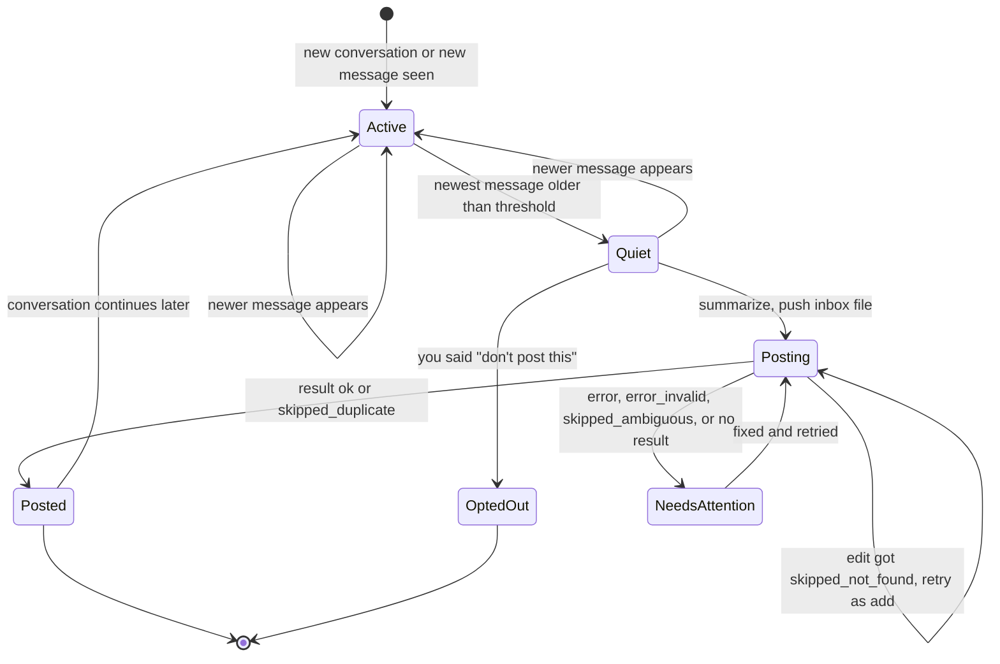
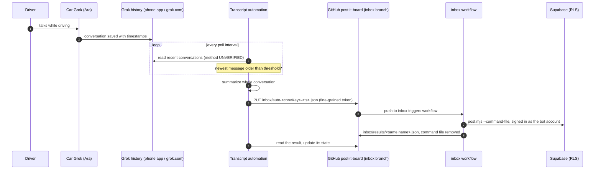

# Transcript automation (primary path)

**What it does:** after you talk to Grok ("Ara") in the Tesla, a small automation notices that the conversation has
gone quiet, summarizes it, and drops a command file into the Post-it Board inbox. The existing GitHub Action then
pins it on https://mogesjohnson.github.io/post-it-board/. You don't have to say "post it", and nothing gets installed
on the phone.

This replaces the earlier plan for a custom Android voice app (see [the comparison](#how-this-replaces-the-phone-app-design)).

> ⚠️ **Read this first: the transcript-reading step is UNVERIFIED.** We know of **no public xAI/Grok API that
> returns your consumer Grok conversation history** (the xAI API is for model inference, not reading your
> grok.com or app chats). So *how* the automation reads the transcript is an open design choice. The options and
> their tradeoffs are in [§2](#2-reading-the-transcript-unverified-choose-one). Everything after the read step
> (silence detection, summary, inbox push, dedup) is fully specified here and uses only the inbox format that
> `post.mjs` already supports.

> **Where the inbox lives:** the `inbox` branch is in **[mogesjohnson/post-it-board](https://github.com/mogesjohnson/post-it-board/tree/inbox)**,
> not in this repo. how-to-post-it only holds docs and has no `inbox` branch. An earlier request mentioned
> "how-to-post-it's inbox branch"; that was a slip. Always push to `mogesjohnson/post-it-board`, branch `inbox`.

Contents

1. [How transcript mirroring works](#1-how-transcript-mirroring-works)
2. [Reading the transcript (UNVERIFIED, choose one)](#2-reading-the-transcript-unverified-choose-one)
3. [The silence-detection loop](#3-the-silence-detection-loop)
4. [Summarize and push to the inbox](#4-summarize-and-push-to-the-inbox)
5. [How it fits with the inbox workflow and its secrets](#5-how-it-fits-with-the-inbox-workflow-and-its-secrets)
6. [Idempotency and dedup](#6-idempotency-and-dedup)
7. [Failure modes](#7-failure-modes)
8. [What you still do by hand](#8-what-you-still-do-by-hand)
9. [How this replaces the phone-app design](#how-this-replaces-the-phone-app-design)

---

## 1. How transcript mirroring works

- When you talk to Grok in the car, the conversation **also shows up in the Grok app on your phone**, in its
  conversation history, **as a transcript with timestamps** (both your turns and Ara's). This is what you've seen
  in your own Grok app. It isn't a documented Tesla or xAI feature, so re-check it after app updates.
- So the transcript lives in your Grok account, not just in the car. Something that can read your Grok history
  can see each car conversation as a list of messages: `who`, `text`, `timestamp`.
- **Silence = time since the newest message.** If the newest message in a conversation is older than the
  threshold (default **8 s**, tunable **5–30 s**), the conversation is treated as finished and gets summarized.
- **Ara is not the one doing this.** It's an outside automation or script, so it works even if you never say
  "post it". You can still say "post it" to have Ara push a note right away
  ([docs/ara-instructions.md](ara-instructions.md)); see [§6](#6-idempotency-and-dedup) for how the two avoid
  posting the same conversation twice.

Things to check on your own phone before you build (see [setup-checklist.md](setup-checklist.md)):

| Question | Why it matters |
|---|---|
| Does **every** car conversation appear, and how soon after you speak? | Sync delay adds directly to the time before a note is posted |
| What resolution do the timestamps have: seconds, minutes, or "2 min ago"? | With minute-level or relative times, an 8 s threshold can't be measured from timestamps alone (see [§3.3](#33-timestamps-clocks-and-time-zones)) |
| Is a timestamp the **start** or the **end** of a message? | If it marks the start, a long answer from Ara looks "silent" while she is still talking |
| Is there any marker that a conversation came **from the car** (title, icon, mode)? | Lets the automation ignore conversations you had on the phone or the web |
| Does one drive become **one conversation**, or several? | Affects how many notes a drive produces |

## 2. Reading the transcript (UNVERIFIED, choose one)

The automation needs one small adapter, `listRecentConversations()` + `getMessages(conversationId)`, that returns
messages with role, text and timestamp. **None of the options below is a confirmed, supported live feed of your
Grok history.** Evaluate them in this order:

| Option | How it would work | Pros | Cons / unknowns |
|---|---|---|---|
| **A. Official API or export** | Use an official xAI endpoint for consumer history, *if one appears*. Today the only official route we know of is the account **data download** (grok.com → Settings → Data Controls), which produces a ZIP snapshot you request by hand. | Supported, stable format, no scraping | No known live API. The export is a **manual, after-the-fact snapshot**: fine for a backfill or a nightly catch-up, useless for an 8-second threshold. Format can change without notice |
| **B. Grok Automation** ([announcement](https://x.ai/news/grok-automations)) | A scheduled Grok Automation is told: "find today's car conversations that aren't on the board yet, summarize them, push inbox files". | Runs inside your Grok account, nothing to host, Grok does the summary itself | **Unverified** whether an Automation can read your *other* conversations, and whether it has a GitHub connector that can write files. The announced schedules are once, daily, weekdays, weekly, monthly or yearly, so this is an **end-of-day sweep**, not silence detection |
| **C. Browser automation of grok.com** | A headless browser (Playwright, Puppeteer…) on an always-on machine, signed in **as you**, opens grok.com history, reads the newest conversations and their timestamps. | The only option here that can poll every few seconds to a minute; full control over the loop | Fragile (breaks when the page layout changes). Needs a long-lived signed-in session, which is effectively **full access to your Grok account** and must be guarded like a password. Session expiry, 2FA and bot detection can stop it. Check xAI's terms of service before relying on it. Polling too often may be rate limited or flagged |
| **D. Ara posts it herself** | No reader at all: you say "post it" (or tell Ara in her instructions to post at the natural end of each conversation). | Already works (the second path), no extra moving parts | Not automatic if you forget. "Post at the end" is unreliable because Ara doesn't know when you are done, and asking her to post after every answer floods the board |

**Recommendation:** start with **D** (it works today) plus a **daily catch-up** via **A** or **B** if either turns
out to be able to read history. Build **C** only if you really want near-real-time auto-posting, and accept its
fragility and the account-access risk. Whatever you choose, keep it behind the adapter interface so the rest of
the loop doesn't change.

**How often can it poll?** That depends entirely on the option:

| Runner | Realistic poll interval | What "8 s threshold" means in practice |
|---|---|---|
| Always-on machine running option C | 15–60 s (be gentle) | Posted roughly 8 s + up to one poll interval + ~1 min for the Action after you stop |
| **GitHub Actions `schedule` (cron)** | **every 5 minutes at best.** GitHub doesn't allow scheduled workflows more often than that, and runs can start late when GitHub is busy | **"At least 8 s of silence, noticed at the next run"**: typically 5–10 minutes after you stop, sometimes more |
| Grok Automation (option B) | about once a day | An end-of-day sweep: the threshold hardly matters |
| Data export (option A) | whenever you request one | Manual backfill only |

So the 8 s number is **a minimum quiet time, not a posting deadline**. The automation never posts a conversation
that has had less than the threshold of silence, but it can post much later than 8 s.

## 3. The silence-detection loop

### 3.1 State per conversation

Keep one small record per conversation, in a local file or tiny database on the machine that runs the loop:

| Field | Meaning |
|---|---|
| `conversationId` | ID from the reader (never published; only its hash goes into file names) |
| `convKey` | first 10 hex characters of `sha256(conversationId)`, safe to put in public file names |
| `lastSeenTs` | timestamp of the newest message seen on the previous poll (UTC) |
| `firstSeenAt` | **local clock** time when that newest message was first noticed |
| `lastPostedTs` | timestamp of the newest message that is already included in a pushed summary |
| `pending` | `{file, lastTs, op}` for a pushed command whose result hasn't been read yet |
| `board` | where the note landed: `{date, pinTitle, pageTitle, pageNumber}` taken from the result file |
| `status` | `active`, `quiet`, `posting`, `posted`, `needs_attention`, or `opted_out` |

If the state file is lost, rebuild `lastPostedTs` and `board` from `inbox/results/auto-<convKey>-*.json` on the
`inbox` branch: the file names carry the last-message timestamp and the results carry `matched.pinTitle`,
`pageNumber` and `date`. That makes the loop recoverable without any extra storage.

### 3.2 State machine



In words:

1. **Active**: the newest message changed since the last poll. Remember it and its `firstSeenAt`.
2. **Quiet**: the newest message is at least `threshold` old (see below for how "old" is measured) and is newer
   than `lastPostedTs`. If the newest message is **yours** (Ara hasn't answered yet), wait longer, e.g. 60 s,
   because Ara may still be about to reply.
3. **Posting**: summarize the **whole** conversation, push one command file, then watch for its result.
4. **Posted**: the result says `ok` (or `skipped_duplicate`, which means it was already there). Save `board` and
   `lastPostedTs`.
5. **Conversation continues later**: back to Active. The next time it goes quiet, the automation sends an **edit**
   that replaces that page's text with a new summary of the whole conversation, instead of adding a second page.

### 3.3 Timestamps, clocks and time zones

- **Convert everything to UTC as soon as you read it.** If the transcript shows a full timestamp with an offset,
  parse it as-is. If it shows only a local time ("9:15 PM"), read it as **America/New_York** with a real time-zone
  library (so daylight-saving changes are handled) and combine it with the conversation's date.
- **Clock skew.** "Time since the newest message" compares *their* clock (the transcript) with *yours* (the
  machine running the loop). Keep that machine NTP-synced. If a message timestamp is in the **future** by more
  than ~5 s, don't trust the difference; fall back to the observation method below.
- **Observation method (recommended whenever timestamps are coarse or skewed).** Measure quiet time as
  `now − firstSeenAt`: how long the newest message has been the newest **by your own clock**. This works
  even with minute-level timestamps, but it can only be as precise as your poll interval, and it needs at least
  two polls.
- **Start vs. end timestamps.** If a timestamp marks the *start* of a message, a long reply from Ara can look
  silent while it is still playing. Either raise the threshold or add an estimate of speaking time
  (roughly the reply length in characters ÷ 15 per second).
- **Board date.** Use the date the conversation **started**, in America/New_York, and put it in the command's
  `date` field explicitly. Otherwise a conversation summarized after midnight would land on the next day (the
  `post.mjs` default is "today in New York" at processing time).

### 3.4 Pseudocode

This is pseudocode, not a runnable script. `reader` is the unverified adapter from [§2](#2-reading-the-transcript-unverified-choose-one);
`summarize` is described in [§4.1](#41-summary).

```text
CONFIG
  thresholdSec     = 8         # clamp to 5..30
  userTurnGraceSec = 60        # extra wait when the newest message is yours
  pollSec          = 30        # whatever your reader allows; GitHub cron: >= 300
  lookbackHours    = 12        # how far back to look for conversations
  repo = "mogesjohnson/post-it-board", branch = "inbox"
  optOutPhrases    = ["don't post this", "do not post", "off the record"]

loop forever:
  now = utc_now()                                         # NTP-synced clock
  try:
    convs = reader.listRecentConversations(since = now - lookbackHours)
  except ReadError as e:
    alert_once("transcript read failed", e); sleep(backoff()); continue

  for conv in convs:
    if not looks_like_car_conversation(conv): continue
    msgs = reader.getMessages(conv.id)                    # [{role, text, ts}] -> ts in UTC
    if msgs is empty: continue
    st   = state.load(conv.id) or rebuild_from_results(hash10(conv.id))
    last = msgs[-1]

    if st.pending: check_result(st); continue             # wait for the Action first
    if last.ts <= st.lastPostedTs: continue               # nothing new since the last post

    if last.ts != st.lastSeenTs:                          # still changing -> Active
      st.lastSeenTs = last.ts; st.firstSeenAt = now; st.status = "active"
      state.save(st); continue

    quiet = now - last.ts
    if timestamps_are_coarse() or last.ts > now + 5s:     # skew or minute resolution
      quiet = now - st.firstSeenAt
    needed = thresholdSec if last.role == "assistant" else max(thresholdSec, userTurnGraceSec)
    if quiet < needed: continue

    if any(user turn contains an optOutPhrase):
      st.status = "opted_out"; st.lastPostedTs = last.ts; state.save(st); continue
    if ara_already_posted(conv, msgs, st):                # see section 6
      st.lastPostedTs = last.ts; state.save(st); continue

    s    = summarize(msgs)                                # {pin, title, body}
    name = "auto-" + hash10(conv.id) + "-" + fmt_utc(last.ts, "YYYYMMDDTHHMMSSZ") + ".json"
    if st.board:
      cmd = {op: "edit", target: "page", date: st.board.date,
             pin: st.board.pinTitle, page: st.board.pageTitle, body: s.body}
    else:
      cmd = {op: "add", date: ny_date(msgs[0].ts), pin: s.pin, title: s.title, body: s.body}

    push_if_absent(repo, branch, "inbox/" + name, json(cmd))   # see section 4.3
    st.pending = {file: name, lastTs: last.ts, op: cmd.op}; st.status = "posting"
    state.save(st)

  sleep(pollSec)

check_result(st):
  r = get_file(repo, branch, "inbox/results/" + st.pending.file)   # 404 -> not processed yet
  if r is missing:
    if pushed more than 10 min ago: alert_once("no result", st.pending.file)
    return
  switch r.status:
    "ok", "skipped_duplicate":
      st.board = {date: r.date, pinTitle: r.matched.pinTitle,
                  pageTitle: (st.board ? st.board.pageTitle : r.input.title),
                  pageNumber: r.pageNumber or st.board.pageNumber}
      st.lastPostedTs = st.pending.lastTs; st.status = "posted"
    "skipped_not_found" when st.pending.op == "edit":    # page was deleted or renamed by hand
      st.board = null                                     # next quiet period sends a fresh add
    otherwise:                                            # error, error_invalid, skipped_ambiguous
      st.status = "needs_attention"; alert(r.status, r.message)
  st.pending = null; state.save(st)
```

## 4. Summarize and push to the inbox

### 4.1 Summary

- **Input:** the full conversation (both sides). **Output:** `pin` (1–4 word topic), `title`, and `body`.
- **Who summarizes** depends on the reader: with option B, Grok does it inside the Automation; with option C you
  need a model. That can be an LLM API you already pay for (xAI text API, Gemini, …) or a local model. This path
  needs **no xAI realtime voice API key**. A text-model key is needed only if your reader can't summarize by itself.
- **Fallback:** if summarization fails, post the last few turns as-is (trimmed to the limits) rather than nothing.
- **Rules for the summary**
  - plain text, key points only, `\n` for line breaks;
  - leave out anything personal or sensitive: **the board and the repo are public**;
  - `pin` ≤ 200 characters, `title` ≤ 200, `body` ≤ 5000 (`post.mjs` rejects longer values with `error_invalid`).
- **Page title:** make it unique and stable, e.g. `Drive 9:15 PM` (the conversation's start time in New York).
  Later edits find the page by this exact title.
- **Pin:** reuse a topic from earlier the same day when it's the same subject. `add` matches pins loosely, so
  "garage shelves" lands on "Garage Shelves".

### 4.2 Command JSON (exactly what `post.mjs` accepts)

Allowed fields: `op`, `date`, `pin`, `title`, `body`, `color`, `target`, `page`, `pageNumber`, `newPin`.
Don't add other fields: `post.mjs` ignores them, so they'd only give a false sense that something is tracked.
Keep the automation's bookkeeping in its own state.

**First post of a conversation (`add`):** file `inbox/auto-3f9c2a71d0-20261006T011512Z.json`

```json
{
  "op": "add",
  "date": "2026-10-05",
  "pin": "Garage shelves",
  "title": "Drive 9:15 PM",
  "body": "Plan: 3 shelves on the left wall, 16 in deep.\nBuy 2x4s and brackets Saturday.\nAsk about a stud finder."
}
```

**The same conversation continued and went quiet again (`edit`):** file `inbox/auto-3f9c2a71d0-20261006T013840Z.json`

```json
{
  "op": "edit",
  "target": "page",
  "date": "2026-10-05",
  "pin": "Garage shelves",
  "page": "Drive 9:15 PM",
  "body": "Plan: 3 shelves on the left wall, 16 in deep.\nBuy 2x4s and brackets Saturday.\nStud finder: borrow from Sam.\nAlso: add a pegboard above the bench."
}
```

For the edit, `pin` must be the **exact** pin title from the first result (`matched.pinTitle`), because the add may
have fuzzy-matched an existing pin with slightly different wording. `page` must be the exact page title, or use
`pageNumber` instead (exactly one of the two). Page numbers can shift if earlier pages are deleted, so the title is safer.

**Result files** appear at `inbox/results/<same name>.json` with `status`, `matched`, `message`, `pageNumber`
and `date`. Full format: [post-it-board inbox/README.md](https://github.com/mogesjohnson/post-it-board/blob/inbox/inbox/README.md).

| status | what the automation does |
|---|---|
| `ok` | record `board` and `lastPostedTs` |
| `skipped_duplicate` | same text already on that pin in the last 10 min: treat as posted |
| `skipped_ambiguous` | the topic could match several pins: alert, then retry `add` with the exact title from `candidates` |
| `skipped_not_found` | an edit found no page (you deleted or renamed it): forget `board`, post a fresh `add` |
| `error_invalid` | bug in the command (too long, wrong field): alert; don't retry the same file |
| `error` | auth, network or database failure in the Action: the command file is **kept**; re-run the workflow, then read the result again |

### 4.3 Naming and pushing

- **Deterministic file name:** `inbox/auto-<convKey>-<last-message UTC YYYYMMDDTHHMMSSZ>.json`.
  - The same conversation state always gives the same name, so a retry after a crash can't create a second command.
  - A newer message gives a new name, so updates never overwrite an unprocessed earlier command.
  - The `auto-` prefix keeps these apart from Ara's `ara-…` files and test files.
  - `convKey` is a hash, so the public repo never shows raw Grok conversation IDs.
- **Push if absent**, using the GitHub REST contents API (the same call as
  [`scripts/send-test-command.sh`](../scripts/send-test-command.sh)):
  1. `GET /repos/mogesjohnson/post-it-board/contents/inbox/results/<name>?ref=inbox`. If it exists, this exact state
     was already processed: read it and stop.
  2. `GET …/contents/inbox/<name>?ref=inbox`. If it exists, it's waiting for the Action: do nothing.
  3. Otherwise `PUT /repos/mogesjohnson/post-it-board/contents/inbox/<name>` with `message`, base64 `content`
     and `branch: "inbox"`. On 409/422 (the branch moved because the Action just pushed), go back to step 1 and retry
     with backoff.
  - Plain `git` works too (clone the `inbox` branch, add the file, `git pull --rebase`, push), but the contents API
    needs no working copy and no conflict handling.
- **Token:** a **fine-grained personal access token** limited to **only `mogesjohnson/post-it-board`**, permission
  **Contents: read and write**, nothing else, expiry ≤ 90 days ([setup-checklist.md](setup-checklist.md) step 2).
  Store it in the runner's secret store (OS keychain, environment of a service account, or an Actions secret if
  the runner is a private workflow), never in a file in any repo.
  - Fine-grained tokens can't be limited to one branch, so this token could also push to `main` (the site code).
    Optional hardening: a branch ruleset on post-it-board's `main` that blocks direct pushes, with a bypass for you
    as admin.

## 5. How it fits with the inbox workflow and its secrets



- **Nothing changes in post-it-board.** The automation is just another writer of inbox files, like Ara and
  `send-test-command.sh`.
- The workflow (`.github/workflows/inbox.yml`) runs on pushes to `inbox` that touch `inbox/*.json`. It runs
  `node scripts/post.mjs --command-file … --result-file inbox/results/<name>.json` as the bot account
  `johnsonmoges+postit-bot@gmail.com`, using the encrypted repo secrets `SUPABASE_URL`, `SUPABASE_ANON_KEY`,
  `SUPABASE_OWNER_EMAIL` and `SUPABASE_OWNER_PASSWORD`. Runs are serialized by a concurrency group, so commands
  from Ara and the automation never race each other in the database.
- **The automation never holds Supabase credentials.** It only holds the GitHub token, plus whatever the reader
  needs (for option C, a signed-in Grok session). Only the Action can sign in to Supabase, and RLS only lets
  accounts listed in `public.board_owners` write. The anon key stays read-only by design, and no `service_role`
  key is used anywhere.
- Results are public (the repo is public), but they contain only note text that the board shows publicly anyway.

## 6. Idempotency and dedup

Layers, from strongest to weakest:

1. **Per-conversation state:** `lastPostedTs`. A conversation is summarized only when its newest message is newer
   than what was last posted, and only after the threshold of quiet time.
2. **Deterministic file names:** one name per (conversation, last message). Re-runs, crashes and overlapping polls
   produce the same name, and *push if absent* refuses to send it twice.
3. **Edit instead of add for continued conversations:** after the first `ok`, later summaries of the same
   conversation are `edit` commands on the same page (exact `pin` + `page`, `target: "page"`), so a drive ends up as
   **one page** that gets updated, not a stack of near-copies.
4. **`skipped_duplicate` in `post.mjs`:** an `add` whose body is identical to a page added to that pin in the
   last 10 minutes is skipped. This is only a backstop: a summarizer seldom produces the exact same text twice.
5. **One runner at a time:** take a lock (lock file, or a `concurrency` group if the runner is a workflow) so two
   copies of the loop never handle the same conversation at once.

**Ara's "post it" and the automation.** If you say "post it" during a conversation, Ara pushes
`inbox/ara-<YYYYMMDDTHHMMSS>-<slug>.json` ([ara-instructions.md](ara-instructions.md)). The automation would then also
summarize the same conversation, with different text, so `skipped_duplicate` won't catch it. Pick one rule and
implement it in `ara_already_posted()`:

- **Simple (recommended):** if the transcript contains you saying "post it" and Ara confirming ("Posted."), treat
  everything up to that point as posted. Only summarize what comes *after* it, if anything substantial.
- **Stricter:** also check `inbox/results/ara-*.json` for a result whose `processedAt` falls inside the
  conversation's time window.

## 7. Failure modes

| Failure | What you see | Handling |
|---|---|---|
| **Automation not running** (machine asleep, crashed, laptop closed) | Nothing posted after a drive | State is based on `lastPostedTs`, so when it comes back it catches up on every conversation inside `lookbackHours`. Add a **daily catch-up** with a longer lookback, plus a heartbeat alert if no poll happened for a long time. Conversations you delete from Grok history before the catch-up are lost |
| **Poll gap** (cron delayed, long poll interval) | Note posted minutes late | Expected: the threshold is a minimum quiet time, not a deadline. GitHub cron can't run more often than every 5 minutes and may start late |
| **Transcript read failure** (page layout changed, export format changed, no access) | Reader errors, nothing posted | Alert once per failure type, back off, keep retrying. Since conversations stay in history, a later successful read still catches up. This is the **most likely** failure for option C |
| **Partial transcript** (sync not finished yet) | Summary missing the last turns | The conversation goes back to Active when more messages arrive, and the next quiet period sends an **edit** with the full summary |
| **Auth expiry** (Grok session signed out, 2FA prompt, GitHub token expired or revoked) | Read fails / GitHub returns 401 or 403 | Alert ("sign in again" / "renew token"). Keep unposted state; nothing is lost while it waits. Calendar reminder before the token's expiry |
| **Rate limits** (Grok side unknown; GitHub REST: about 5,000 requests per hour per token, plus secondary limits on rapid writes) | 429 / 403 with retry headers | Poll gently, back off exponentially, honour `Retry-After`. One push per finished conversation is far below GitHub's limits |
| **GitHub push failure** (network, 409/422 because the Action pushed at the same moment) | PUT fails | Retry *push if absent* with backoff. The name is deterministic, so retries can't duplicate |
| **Action failure** (`error` in `inbox/results/<name>.json`, or a red run in the post-it-board Actions tab) | Result `error`, or no result at all after ~10 min | The workflow **keeps** the command file on `error`. Fix the cause (e.g. bot password rotated without updating the secret) and re-run the workflow (it has `workflow_dispatch`). The automation alerts if no result appears |
| **Bad command** (`error_invalid`) | Result `error_invalid` | A bug in the automation (usually length limits). Alert; don't retry the same file |
| **Wrong topic / ambiguous** (`skipped_ambiguous`) | Result lists `candidates` | Retry with the exact pin title, or leave it for you to fix by hand |
| **Duplicate summaries** | Two pages for one drive | Usually Ara's "post it" plus the automation, or lost state: see [§6](#6-idempotency-and-dedup). Delete the extra page on the board |
| **Not a car conversation** | Phone or web chats get posted | Filter with `looks_like_car_conversation()` (marker, time window, or only conversations you started while driving). Use the opt-out phrase for anything private |

**Car dead zones mostly stop mattering.** The automation runs outside the car and reads the transcript after it
has synced to your Grok account, so a weak signal on the road only delays when a conversation appears. It doesn't
lose the post, and there's no local queue on the phone to manage. (Ara herself still needs a connection to talk
at all.) What does matter now is **read failures** on the automation's side.

## 8. What you still do by hand

- **Once:** change the Supabase owner password, create the fine-grained token, choose and set up the reader, and
  check what the transcript looks like on your phone ([setup-checklist.md](setup-checklist.md)).
- **After the first real drives:** tune the threshold (5–30 s, start at 8) and the "your turn" grace period.
- **Ongoing:** sign the reader in again when its session expires (option C), renew the GitHub token before it
  expires, glance at the board and fix or delete a bad note, and act on alerts.
- **When you want it pinned right now:** say "post it" to Ara, as before.
- **When something is private:** say "don't post this" (or your chosen opt-out phrase) in the car.

## How this replaces the phone-app design

The earlier plan ([ai-studio-prompt.md](ai-studio-prompt.md), now **superseded / optional legacy**) was a native
Android app built with Google AI Studio that ran its **own** Ara session over xAI's realtime voice API, started an
8 s timer when Ara finished speaking, and needed a widget, a foreground service and Bluetooth audio routing.

| | Old: custom Android voice app (legacy) | New: transcript automation (primary) |
|---|---|---|
| Who you talk to | The app's own Ara session over Bluetooth | The car's built-in Grok, as normal |
| Car controls and navigation by voice | ❌ not in the app's session | ✅ unchanged |
| Code on the phone | Kotlin app, widget, foreground service, Bluetooth audio routing | **None** |
| Taps before driving | One tap to start the mic (Android 14+ limit) | **None** |
| Silence detection | Exact: realtime "Ara finished speaking" events + 8 s timer (5–30) | Approximate: newest transcript timestamp vs. now, threshold 8 s (5–30), checked at each poll |
| Posting latency | ~8 s + network | Threshold + poll interval + ~1 min Action (5+ minutes with GitHub cron) |
| xAI API key | Required (realtime voice, billed per minute) | **Not needed** for voice. A text-model key only if your reader can't summarize |
| Secrets on the phone | GitHub token + xAI key in Keystore-backed storage | **None.** GitHub token on the automation's runner |
| Dead zones | Local queue + retries on the phone | Don't matter: the transcript syncs later |
| Battery / OEM app killers | Real risk | Not on the phone |
| Biggest unknown | AI Studio Android build, audio routing in the Tesla | **How to read the Grok transcript** (no known public API) |
| "Post it" by voice | In the app | Ara pushes the file directly, as before |

The legacy docs stay in the repo in case the transcript can't be read reliably and you want exact, real-time
silence detection after all.
