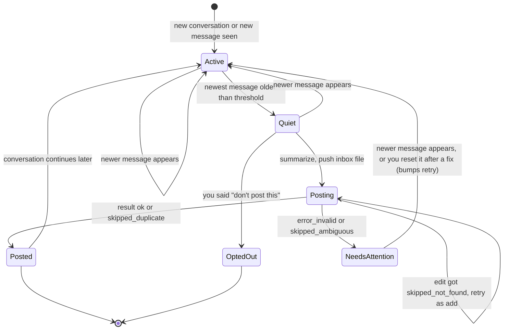
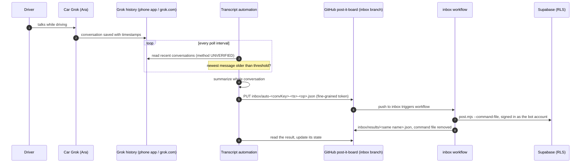

# Transcript automation (primary path)

**What it does:** after you talk to Grok ("Ara") in the Tesla, a small automation notices that the conversation has
gone quiet, summarizes it, and drops a command file into the Post-it Board inbox. The existing GitHub Action then
pins it on https://mogesjohnson.github.io/post-it-board/. You don't have to say "post it", and nothing gets installed
on the phone.

This replaces the earlier plan for a custom Android voice app (see [the comparison](#how-this-replaces-the-phone-app-design)).

> ⚠️ **Read this first: the transcript-reading step is UNVERIFIED.** We know of **no public xAI/Grok API that
> returns your consumer Grok conversation history** (the xAI API is for model inference, not reading your
> grok.com or app chats). So *how* the automation reads the transcript is an open design choice. The options and
> their tradeoffs are in [§2](#2-reading-the-transcript-unverified-choose-one). Everything after the read step
> (silence detection, summary, inbox push, dedup) is fully specified here and uses only the inbox format that
> `post.mjs` already supports.

> **Where the inbox lives:** the `inbox` branch is in **[mogesjohnson/post-it-board](https://github.com/mogesjohnson/post-it-board/tree/inbox)**,
> not in this repo. how-to-post-it only holds docs and has no `inbox` branch. An earlier request mentioned
> "how-to-post-it's inbox branch"; that was a slip. Always push to `mogesjohnson/post-it-board`, branch `inbox`.

Contents

1. [How transcript mirroring works](#1-how-transcript-mirroring-works)
2. [Reading the transcript (UNVERIFIED, choose one)](#2-reading-the-transcript-unverified-choose-one)
3. [The silence-detection loop](#3-the-silence-detection-loop)
4. [Summarize and push to the inbox](#4-summarize-and-push-to-the-inbox)
5. [How it fits with the inbox workflow and its secrets](#5-how-it-fits-with-the-inbox-workflow-and-its-secrets)
6. [Idempotency and dedup](#6-idempotency-and-dedup)
7. [Failure modes](#7-failure-modes)
8. [What you still do by hand](#8-what-you-still-do-by-hand)
9. [How this replaces the phone-app design](#how-this-replaces-the-phone-app-design)

---

## 1. How transcript mirroring works

- When you talk to Grok in the car, the conversation **also shows up in the Grok app on your phone**, in its
  conversation history, **as a transcript with timestamps** (both your turns and Ara's). This is what you've seen
  in your own Grok app. It isn't a documented Tesla or xAI feature, so re-check it after app updates.
- So the transcript lives in your Grok account, not just in the car. Something that can read your Grok history
  can see each car conversation as a list of messages: `who`, `text`, `timestamp`.
- **Silence = time since the newest message.** If the newest message in a conversation is older than the
  threshold (default **8 s**, tunable **5–30 s**), the conversation is treated as finished and gets summarized.
- **Ara is not the one doing this.** It's an outside automation or script, so it works even if you never say
  "post it". You can still say "post it" to have Ara push a note right away
  ([docs/ara-instructions.md](ara-instructions.md)); see [§6](#6-idempotency-and-dedup) for how the two avoid
  posting the same conversation twice.

Things to check on your own phone before you build (see [setup-checklist.md](setup-checklist.md)):

| Question | Why it matters |
|---|---|
| Does **every** car conversation appear, and how soon after you speak? | Sync delay adds directly to the time before a note is posted |
| What resolution do the timestamps have: seconds, minutes, or "2 min ago"? | With minute-level or relative times, an 8 s threshold can't be measured from timestamps alone (see [§3.3](#33-timestamps-clocks-and-time-zones)) |
| Is a timestamp the **start** or the **end** of a message? | If it marks the start, a long answer from Ara looks "silent" while she is still talking |
| Is there any marker that a conversation came **from the car** (title, icon, mode)? | Lets the automation ignore conversations you had on the phone or the web |
| Does one drive become **one conversation**, or several? | Affects how many notes a drive produces |

## 2. Reading the transcript (UNVERIFIED, choose one)

The automation needs one small adapter, `listRecentConversations()` + `getMessages(conversationId)`, that returns
messages with role, text and timestamp. **None of the options below is a documented, supported, public feed of
your Grok history.** What research on Oct 5, 2026 actually found is in
[§2.2](#22-what-the-research-found-verified-vs-reported); xAI's terms are in [§2.3](#23-what-xais-terms-say); the
detailed comparison of the two realistic readers is in [§2.4](#24-rest-reads-vs-browser-automation-for-this-use-case),
and the recommendation in [§2.5](#25-recommendation).

### 2.1 The options at a glance

| Option | How it would work | Pros | Cons / unknowns |
|---|---|---|---|
| **A. Official API or export** | Use an official xAI endpoint for consumer history, *if one appears*. Today the only official route we know of is the account **data download** (grok.com -> Settings -> Data Controls), which produces a ZIP snapshot you request by hand. | Supported, stable format, no scraping | No known live API. The export is a **manual, after-the-fact snapshot**: fine for a backfill or a nightly catch-up, useless for an 8-second threshold. Format can change without notice |
| **B. Grok Automation** ([announcement](https://x.ai/news/grok-automations)) | A scheduled Grok Automation is told: "find today's car conversations that aren't on the board yet, summarize them, push inbox files". | Runs inside your Grok account, nothing to host, Grok does the summary itself | **Unverified** whether an Automation can read your *other* conversations, and whether it has a GitHub connector that can write files. The announced schedules are once, daily, weekdays, weekly, monthly or yearly, so this is an **end-of-day sweep**, not silence detection |
| **C1. REST reads with your grok.com session** | A small script on an always-on machine calls the same **undocumented, same-origin** JSON endpoints grok.com's own web page uses (list conversations, then load one conversation's messages), sending your grok.com session cookies. | Cheap and fast: one small JSON request per poll, so it can poll every few seconds. Exact timestamps from JSON, no page parsing | **Private, undocumented endpoints** that xAI can change or lock down anytime. A session cookie is **full access to your Grok account**. Anti-bot challenges, cookie expiry, and xAI's terms ([§2.3](#23-what-xais-terms-say)) are real risks |
| **C2. Browser automation of grok.com** | A real browser (Playwright, Puppeteer, or a tool such as Reduck) with a **persistent profile** signed in as you opens grok.com, then reads the conversation list and transcript, either by calling the same endpoints from inside the page or by reading the rendered page. | Behaves like you using the site; the browser keeps its own cookies fresh; can still work when direct requests get challenged | Heavier and slower (seconds per read, hundreds of MB of memory). Breaks when the page layout changes (if it reads the DOM). Same account-access and terms risks as C1 |
| **D. Ara posts it herself** | No reader at all: you say "post it" (or tell Ara in her instructions to post at the natural end of each conversation). | No extra moving parts, fully within the product. **Untested:** assumes Ara can create files in GitHub | Not automatic if you forget. "Post at the end" is unreliable because Ara doesn't know when you are done, and asking her to post after every answer floods the board |

### 2.2 What the research found (verified vs reported)

Checked on Oct 5, 2026 with read-only GitHub queries and public web pages. **No grok.com endpoint was called** (with
or without credentials), so nothing here proves these endpoints work for *your* account or for *car* conversations.

| Claim | Status | Evidence |
|---|---|---|
| grok.com's web app uses `GET https://grok.com/rest/app-chat/conversations` (list) and `POST https://grok.com/rest/app-chat/conversations/{id}/load-responses` (message bodies) | **Verified in third-party source code**, not in any xAI documentation | [pinguarmy/ai-chat-exporter `src/lib/grok-api.ts`](https://github.com/pinguarmy/ai-chat-exporter/blob/main/src/lib/grok-api.ts) calls the list with `pageSize`/`pageToken`, then `conversations_v2/{id}`, then `conversations/{id}/response-node` (to get `responseIds`), then `POST .../load-responses` with body `{"responseIds": [...]}`. [0xSMW/swift-grok `GrokClient+Conversations.swift`](https://github.com/0xSMW/swift-grok/blob/main/Sources/GrokClient/Endpoints/GrokClient%2BConversations.swift) does the same list, `response-node` and `load-responses` calls |
| Fields useful for silence detection | **Verified in source code** (field names only; not checked against a live response) | List items carry `conversationId`, `title`, `createTime`, `modifyTime` (swift-grok `ConversationModels.swift`; xAI's own grok-build reads the same, below). Loaded responses carry `responseId`, `message`, `sender`, `createTime` (swift-grok `Response` model; ai-chat-exporter reads `sender` and `createTime`) |
| Auth = your grok.com session cookies | **Verified in source code** | ai-chat-exporter is a browser extension that calls the endpoints from the grok.com page with `credentials: 'include'` (the browser attaches your cookies). swift-grok sends a `Cookie` header and requires at least one of `sso`, `sso-rw`, `x-userid`, `x-anonuserid`; its cookie extractor also collects optional `x-challenge`, `x-signature`, `cf_clearance`, `__cf_bm`, and the client sends an `x-statsig-id` header plus browser-like headers |
| "xai-org/swift-grok" is an official xAI repo | **False** | `xai-org/swift-grok` does not exist (GitHub 404). The Swift client is [0xSMW/swift-grok](https://github.com/0xSMW/swift-grok) (`klu-ai/swift-grok` redirects there), which its own author labels an *"unofficial grok api library"*; MIT, ~22 stars, last commit Aug 17, 2026. The real [xai-org](https://github.com/xai-org) org lists no swift-grok |
| pinguarmy/ai-chat-exporter exists and covers Grok | **Verified** | [Repo](https://github.com/pinguarmy/ai-chat-exporter): TypeScript browser extension (Chrome/Firefox/Edge), MIT, ~11 stars, last commit Oct 2, 2026. It's an on-demand exporter in your open browser, not a headless poller |
| xAI's **own** open-source code calls the list endpoint | **Verified** (interesting signal, not a public API) | xAI's [grok-build](https://github.com/xai-org/grok-build) CLI has [`conversations_client.rs`](https://github.com/xai-org/grok-build/blob/main/crates/codegen/xai-grok-shell/src/remote/conversations_client.rs) calling `GET {base}/rest/app-chat/conversations` (default base `https://grok.com`) with an **OAuth bearer token**, not cookies; its login config requests scopes including `conversations:read`. That client only lists/renames/stars/deletes conversations; it does not load message bodies. It hints a token route may exist, but it's undocumented for third parties. **Don't borrow grok-build's login or tokens for this project**; watch for xAI documenting it |
| Car **voice** conversations return transcript text through these endpoints | **Unverified, with a warning sign** | The archiver [dotCipher/ai-vault](https://github.com/dotCipher/ai-vault/blob/3dde18d2/src/providers/grok-web/index.ts) notes under *KNOWN LIMITATIONS*: *"Voice conversations: Audio files are not accessible through the web interface or API. Only metadata (title, timestamps) can be archived."* Whether that applies to Tesla conversations (which you see as text in the app) is unknown. **Test this first** (setup step 4) |
| Reduck automates grok.com with saved cookies in a hosted or local browser | **Partly verified** | [reduck.ai](https://reduck.ai/) and [docs.reduck.ai](https://docs.reduck.ai/) say scripts run *"in your own Chrome, through our extension"* using your logged-in state, and are also callable by REST API or cron. The pricing table says local runs *"Needs your device on"*, and the cloud browser is *"Auth-based sites coming soon with connectors"*, so **hosted runs using your grok.com login are not offered there today**. A specific Reduck Grok transcript script (reported as `reduck/grok.com/get_chat_messages`) **could not be verified**: no public page was found. Reduck also advertises *"Work behind logins and bypass anti-bot"* -- do not point that at grok.com (see §2.3) |
| GitHub Actions cron can't run more often than every 5 minutes | **Verified** | [GitHub docs](https://docs.github.com/en/actions/reference/workflows-and-actions/events-that-trigger-workflows#schedule): *"The shortest interval you can run scheduled workflows is once every 5 minutes."* and *"The `schedule` event can be delayed during periods of high loads of GitHub Actions workflow runs."* |
| Datacenter IPs (Actions runners, cloud VMs) trip grok.com challenges more often | **Unverified** (plausible; commonly reported for Cloudflare-fronted sites) | swift-grok's optional `cf_clearance` / `__cf_bm` cookies indicate Cloudflare sits in front of grok.com |

### 2.3 What xAI's terms say

Quoted from the pages as fetched on Oct 5, 2026. **Read them yourself before building C1 or C2.** This is not legal advice.

From the [Acceptable Use Policy](https://x.ai/legal/acceptable-use-policy) (effective Aug 14, 2026), which the
consumer terms make binding. The AUP prohibits, among other things:

> - *"Accessing the Services through unauthorized automated or non-human means, whether through a bot, script, or otherwise"*
> - *"Scraping, harvesting or reselling any Input or Output, or distilling model data or Outputs"*
> - *"...using bots to access, reverse engineer, decompile, disassemble or otherwise seek to obtain the source code of our Service..."*
> - *"Disrupting, interfering with, or unauthorized access to the Service or its safety systems, including circumventing any rate limits or restrictions or protective measures and safety mitigations"*

and warns: *"Violating our policies could result in action against your account, up to suspension or termination."*

From the [consumer Terms of Service](https://x.ai/legal/terms-of-service) (last updated Sep 11, 2026):

> - *"You may not share your account credentials or make your account available to anyone else, and are responsible for all activities that occur under your account."*
> - *"At our sole discretion, we may implement rate limitations to accommodate system resources or usage needs."*

What this means here:

- **Both C1 and C2 are automated access by a script or bot.** On a plain reading the AUP does not authorize either,
  even for your own conversations, and using a browser does not make C2 more acceptable than C1. The realistic
  downside is **action against your account (up to suspension)**, not just breakage.
- **Never bypass protections.** If grok.com returns a challenge, CAPTCHA or rate limit, **stop and alert** -- don't
  solve it automatically, rotate IPs, or reach for "anti-bot bypass" features.
- If you proceed anyway, stay as gentle as possible: **your own account only, read-only, low poll rate, no parallel
  requests**, honour `429`/`Retry-After`, and never hand the session to a third-party service. Only Ara's "post it"
  (option D) and the manual data export (option A) are clearly inside the product as designed.

### 2.4 REST reads vs browser automation for this use case

The job: every few seconds, check the newest timestamp of the most recent car conversation, decide whether it has
been quiet for 8+ seconds, then load that one conversation, summarize it, and push one inbox JSON file.

| Dimension | **C1. REST reads (session cookies)** | **C2. Browser automation (persistent profile)** |
|---|---|---|
| **Reliability** | High *while* the endpoints and cookie stay valid; a single HTTP call with little to parse. Breaks instantly if xAI changes the endpoint, the auth, or adds a challenge | More robust to small endpoint tweaks if it reads the rendered page; but DOM scraping breaks on layout changes, and the browser itself (updates, memory, crashes) is one more thing that fails |
| **Auth & where the secret lives** | Your grok.com **session cookies** (`sso`, `sso-rw`, etc.), stored only on the poller machine (file with `600` perms, OS keychain, or an **encrypted** secret). A cookie is **full account access** | A **persistent browser profile** logged in as you, on the poller machine. The whole profile directory is the secret and is **full account access**. The browser refreshes the cookie itself, so it survives rotation better |
| **Cookie expiry / rotation** | Cookies expire or get invalidated; you must re-extract and re-inject them by hand when that happens (health check flags it) | The signed-in browser renews cookies as it's used, so it needs manual re-login less often |
| **Anti-bot / Cloudflare / 2FA** | A bare client is the **most likely to be challenged**, especially from a datacenter IP; it can't solve a challenge and shouldn't try | A real browser with your fingerprint and residential IP is **less likely to be challenged**; still can't (and must not) bypass one. 2FA / Google sign-in happens once when you log the profile in |
| **Rate limits / breakage if xAI changes things** | Cheap enough to stay well under any limit at a low poll rate; **brittle** to endpoint or schema changes (mitigate with the health check in [§7](#7-failure-modes)) | Same exposure to endpoint changes if it calls them in-page; if it reads the DOM, it survives API changes but breaks on UI changes |
| **Latency** | Sub-second per poll; silence is noticed within about one poll interval | Seconds per read (page load / render); detection is coarser and slower |
| **Resource usage** | Tiny: a cron-like script, a few MB | Heavy: a full Chrome, hundreds of MB of RAM, more CPU; needs a display or headless setup |
| **Headless / scheduled operation** | Runs fine as a background service on an always-on machine or the box. **Poor fit for GitHub Actions cron**: 5-minute minimum ([verified](#22-what-the-research-found-verified-vs-reported)) defeats an 8 s threshold, and datacenter IPs are the most likely to be challenged | Can run headless on an always-on machine; even worse on GitHub Actions (no persistent profile, datacenter IP, heavy) |
| **Legal / ToS** | Automated script access; see [§2.3](#23-what-xais-terms-say) | Also automated access; a browser doesn't make it sanctioned. "Bypass anti-bot" tooling makes it worse |

**Why not GitHub Actions cron for the reader.** Even though the *inbox workflow* runs on GitHub, the **reader** should
not: cron's 5-minute floor makes "8 s of silence" meaningless (you'd detect it minutes later), runs can be delayed
under load, there's no persistent browser profile, and datacenter IPs are the most likely to hit grok.com
challenges. Run the reader on an **always-on machine you control** (a home server, a Raspberry Pi, or this box) and
keep GitHub only for applying inbox files.

### 2.5 Recommendation

- **Primary: C1, REST reads with your grok.com session, on an always-on machine you control.** It's the only option
  that can honour a few-second silence threshold cheaply. Concretely:
  - **Poll the conversation list cheaply** (`GET /rest/app-chat/conversations?pageSize=…`) every **5-10 s only while
    a recent car conversation looks active**, and back off to every few minutes when nothing is changing.
  - **Load message bodies only when a conversation changed** (its `modifyTime` / newest timestamp advanced), via
    `response-node` + `load-responses` -- never on every poll.
  - Keep the session cookie **only** on that machine (file with strict perms, OS keychain, or an encrypted secret).
    **Never** put it in this public repo, in any inbox file, or in chat.
  - Treat the endpoints as private and unstable, run read-only, your own account only, and honour `429`s.
- **Fallback: C2, browser automation with a persistent signed-in profile**, used **when C1 breaks or gets
  challenged** -- cookie expired, a Cloudflare/anti-bot challenge, or a schema change. The browser keeps its own
  session fresh and looks more like a human session, at the cost of speed and resources.
- **Make the reader a feature flag.** Put both behind the same `listRecentConversations()` / `getMessages()` adapter
  and a `READER=rest|browser` switch, so switching is a config change, not a rewrite. A health check
  ([§7](#7-failure-modes)) should **alert on auth failure, a challenge page, or a schema change** (e.g. expected
  fields missing) and can auto-fail over from `rest` to `browser`.
- **Keep D (Ara's "post it") as the manual path** once it's tested (it assumes Ara can write to GitHub), and **A (manual export)** for an occasional
  backfill. **B (Grok Automation)** only if it turns out it can read other conversations and write to GitHub.
- **Honesty, unchanged:** the endpoints are undocumented and unsupported, whether *voice/car* conversations return
  transcript text through them is **unverified** (test it first -- setup step 4), and automated access of grok.com is
  in tension with xAI's AUP ([§2.3](#23-what-xais-terms-say)). If you're not comfortable with the account risk, you're
  left with A (manual export) and D (Ara's "post it"), and D is untested. **Don't** build on xAI's internal
  grok-build OAuth or borrow its tokens.

## 3. The silence-detection loop

### 3.1 State per conversation

Keep one small record per conversation, in a local file or tiny database on the machine that runs the loop:

| Field | Meaning |
|---|---|
| `conversationId` | ID from the reader (never published; only its hash goes into file names) |
| `convKey` | first 10 hex characters of `sha256(conversationId)`, safe to put in public file names |
| `lastSeenTs` | timestamp of the newest message seen on the previous poll (UTC) |
| `lastLoadedModify` | the conversation's `modifyTime` the last time bodies were loaded, so unchanged conversations skip the costly load |
| `firstSeenAt` | **local clock** time when that newest message was first noticed |
| `lastPostedTs` | timestamp of the newest message that is already included in a pushed summary |
| `pending` | `{file, lastTs, op, pushedAt}` for a pushed command whose result hasn't been read yet |
| `board` | where the note landed: `{date, pinTitle, pageTitle, pageNumber}` taken from the result file |
| `status` | `active`, `quiet`, `posting`, `posted`, `needs_attention`, or `opted_out` |
| `retry` | starts at 0; a manual reset adds 1, so the retried command gets a new file name (`…-<op>-r1.json`) |

If the state file is lost, rebuild `lastPostedTs` and `board` from `inbox/results/auto-<convKey>-*.json` on the
`inbox` branch: the file names carry the last-message timestamp and the results carry `matched.pinTitle`,
`pageNumber` and `date`. That makes the loop recoverable without any extra storage. Message bodies aren't part of
this record: the loop keeps the last loaded copy in memory only, and loads it again after a restart.

### 3.2 State machine



In words:

1. **Active**: the newest message changed since the last poll. Remember it and its `firstSeenAt`.
2. **Quiet**: the newest message is at least `threshold` old (see below for how "old" is measured) and is newer
   than `lastPostedTs`. If the newest message is **yours** (Ara hasn't answered yet), wait longer, e.g. 60 s,
   because Ara may still be about to reply.
3. **Posting**: summarize the **whole** conversation, push one command file, then watch for its result.
4. **Posted**: the result says `ok` (or `skipped_duplicate`, which means it was already there). Save `board` and
   `lastPostedTs`.
5. **Conversation continues later**: back to Active. The next time it goes quiet, the automation sends an **edit**
   that replaces that page's text with a new summary of the whole conversation, instead of adding a second page.
6. **Needs attention**: `error_invalid` or `skipped_ambiguous`. The automation alerts and leaves that conversation
   alone until a newer message arrives or you reset it. A reset sets the status back to `quiet` and adds 1 to
   `retry`, so the retried command gets a new file name instead of finding the old result again. An `error` is
   different: it alerts once and keeps waiting for the same result file, which a re-run of the workflow rewrites.
   If the command file disappears without a result (someone deleted it), the conversation also needs attention.

### 3.3 Timestamps, clocks and time zones

- **Convert everything to UTC as soon as you read it.** If the transcript shows a full timestamp with an offset,
  parse it as-is. If it shows only a local time ("9:15 PM"), read it as **America/New_York** with a real time-zone
  library (so daylight-saving changes are handled) and combine it with the conversation's date.
- **Clock skew.** "Time since the newest message" compares *their* clock (the transcript) with *yours* (the
  machine running the loop). Keep that machine NTP-synced. If a message timestamp is in the **future** by more
  than ~5 s, don't trust the difference; fall back to the observation method below.
- **Observation method (recommended whenever timestamps are coarse or skewed).** Measure quiet time as
  `now − firstSeenAt`: how long the newest message has been the newest **by your own clock**. This works
  even with minute-level timestamps, but it can only be as precise as your poll interval, and it needs at least
  two polls.
- **Start vs. end timestamps.** If a timestamp marks the *start* of a message, a long reply from Ara can look
  silent while it is still playing. Either raise the threshold or add an estimate of speaking time
  (roughly the reply length in characters ÷ 15 per second).
- **Board date.** Use the date the conversation **started**, in America/New_York, and put it in the command's
  `date` field explicitly. Otherwise a conversation summarized after midnight would land on the next day (the
  `post.mjs` default is "today in New York" at processing time).

### 3.4 Pseudocode

This is pseudocode, not a runnable script. `reader` is the unverified adapter from [§2](#2-reading-the-transcript-unverified-choose-one);
`summarize` is described in [§4.1](#41-summary).

```text
CONFIG
  reader           = "rest"    # "rest" (C1, primary) or "browser" (C2, fallback) -- same adapter
  thresholdSec     = 8         # clamp to 5..30
  userTurnGraceSec = 60        # extra wait when the newest message is yours
  activePollSec    = 7         # poll the list this often WHILE a car conversation looks active (5-10 s)
  idlePollSec      = 180       # back off to this when nothing is changing
  lookbackHours    = 12        # how far back to look for conversations
  repo = "mogesjohnson/post-it-board", branch = "inbox"
  optOutPhrases    = ["don't post this", "do not post", "off the record"]

cache = {}                                                # conversation id -> loaded messages, in memory only

loop forever:
  now = utc_now()                                         # NTP-synced clock
  try:
    convs = reader.listRecentConversations(since = now - lookbackHours)   # cheap list poll; see section 2.5
  except AuthError as e:   health.fail("auth", e);      maybe_failover(); sleep(backoff()); continue
  except ChallengeError as e: health.fail("challenge", e); sleep(long_backoff()); continue   # never bypass
  except SchemaError as e: health.fail("schema", e);    maybe_failover(); sleep(backoff()); continue
  except ReadError as e:   health.fail("read", e);      sleep(backoff()); continue
  health.ok()
  any_active = false

  for conv in convs:
    if not looks_like_car_conversation(conv): continue
    st = state.load(conv.id) or rebuild_from_results(hash10(conv.id))
    if st.pending: check_result(st); continue             # wait for the Action first (reads GitHub, not grok.com)
    if conv.id not in cache or conv.modifyTime > st.lastLoadedModify:   # changed, or not loaded since start
      cache[conv.id] = reader.getMessages(conv.id)        # the costly load, ONLY when the conversation changed
      st.lastLoadedModify = conv.modifyTime
      any_active = true                                   # something changed -> poll fast next time
    msgs = cache[conv.id]                                 # unchanged: reuse the copy in memory, still check quiet
    if msgs is empty: continue
    last = msgs[-1]

    if last.ts <= st.lastPostedTs: continue               # nothing new since the last post
    if st.status == "needs_attention" and last.ts == st.lastSeenTs: continue   # wait for a fix or a newer message

    if last.ts != st.lastSeenTs:                          # still changing -> Active
      st.lastSeenTs = last.ts; st.firstSeenAt = now; st.status = "active"
      state.save(st); continue

    quiet = now - last.ts
    if timestamps_are_coarse() or last.ts > now + 5s:     # skew or minute resolution
      quiet = now - st.firstSeenAt
    needed = thresholdSec if last.role == "assistant" else max(thresholdSec, userTurnGraceSec)
    if quiet < needed: any_active = true; continue        # not quiet yet: keep polling fast

    if any(user turn contains an optOutPhrase):
      st.status = "opted_out"; st.lastPostedTs = last.ts; state.save(st); continue
    todo = msgs[ara_post_point(msgs):]                    # only what came after Ara's "Posted." (section 6), else all
    if not substantial(todo):                             # Ara already posted everything worth keeping
      st.lastPostedTs = last.ts; state.save(st); continue

    s    = summarize(todo)                                # {pin, title, body}
    if st.board:
      cmd = {op: "edit", target: "page", date: st.board.date, pin: st.board.pinTitle, body: s.body}
      if st.board.pageTitle: cmd.page = st.board.pageTitle          # exact title: safer, numbers can shift
      else: cmd.pageNumber = st.board.pageNumber                    # the page has no title
    else:
      cmd = {op: "add", date: ny_date(msgs[0].ts), pin: s.pin, title: s.title, body: s.body}
    # the op is part of the name, so a fresh add after a failed edit can't collide with it (section 4.3);
    # st.retry (bumped by a manual reset) gives a retried command a new name, so the stale result isn't re-read
    name = "auto-" + hash10(conv.id) + "-" + fmt_utc(last.ts, "YYYYMMDDTHHMMSSZ") + "-" + cmd.op
           + (st.retry ? "-r" + st.retry : "") + ".json"

    push_if_absent(repo, branch, "inbox/" + name, json(cmd))   # see section 4.3
    st.pending = {file: name, lastTs: last.ts, op: cmd.op, pushedAt: now}; st.status = "posting"
    state.save(st)

  sleep(any_active ? activePollSec : idlePollSec)

check_result(st):
  r = get_file(repo, branch, "inbox/results/" + st.pending.file)   # 404 -> not processed yet
  if r is missing:
    if not exists(repo, branch, "inbox/" + st.pending.file):    # command gone too: deleted by hand, or processed
      r = get_file(repo, branch, "inbox/results/" + st.pending.file)   #   between the two reads, so look once more
      if r is missing:                                    # deleted without a result: a person has to look
        st.status = "needs_attention"; alert("command removed without a result", st.pending.file)
        st.pending = null; state.save(st); return
    if r is missing:
      if now - st.pending.pushedAt > 10 min: alert_once("no result", st.pending.file)
      return
  switch r.status:
    "ok", "skipped_duplicate":
      prev = st.board                                     # null on the first add
      st.board = {date: r.date, pinTitle: r.matched.pinTitle,
                  pageTitle: prev ? prev.pageTitle         # dedup needs the same title too, so on a first add
                           : (trim(r.input.title) or null),   # (ok or skipped_duplicate) this is the page's title
                  pageNumber: r.pageNumber or (prev ? prev.pageNumber : null)}
      st.lastPostedTs = st.pending.lastTs; st.status = "posted"
    "skipped_not_found" when st.pending.op == "edit":    # page was deleted or renamed by hand
      st.board = null; st.status = "quiet"                # the next poll sends a fresh add (its name ends in -add)
    "error":                                              # the Action kept the command file
      alert_once("error", r.message); return              # keep pending: a workflow re-run rewrites this result
    otherwise:                                            # error_invalid, skipped_ambiguous: a person has to look
      st.status = "needs_attention"; alert(r.status, r.message)
  st.pending = null; state.save(st)
```

## 4. Summarize and push to the inbox

### 4.1 Summary

- **Input:** the full conversation (both sides). **Output:** `pin` (1–4 word topic), `title`, and `body`.
- **Who summarizes** depends on the reader: with option B, Grok does it inside the Automation; with the REST/browser reader (C1/C2) you
  need a model. That can be an LLM API you already pay for (xAI text API, Gemini, …) or a local model. This path
  needs **no xAI realtime voice API key**. A text-model key is needed only if your reader can't summarize by itself.
- **Fallback:** if summarization fails, post the last few turns as-is (trimmed to the limits) rather than nothing.
- **Rules for the summary**
  - plain text, key points only, `\n` for line breaks;
  - leave out anything personal or sensitive: **the board and the repo are public**;
  - the text also stays in the public repo's `inbox` branch history (command and result files), even after the note
    is deleted from the board. Only a history rewrite of that branch removes it;
  - `pin` ≤ 200 characters, `title` ≤ 200, `body` ≤ 5000 (`post.mjs` rejects longer values with `error_invalid`).
- **Page title:** make it unique and stable, e.g. `Drive 9:15 PM` (the conversation's start time in New York).
  Later edits find the page by this exact title.
- **Pin:** when it's the same subject as a note from earlier the same day, reuse that pin's **exact** title (keep the
  titles you've posted in state). `add` ignores case, spaces, accents and punctuation, so "garage shelves" lands on
  "Garage Shelves". Typos are forgiven only narrowly: both titles need the same number of words, at most 2 words may
  differ, each by a single missing, extra or swapped letter (never a changed one), and only in all-letter words with
  5+ letters in both spellings that keep their first letter. So short different words like "Code" and "Node" become
  separate pins, while a few real pairs like "Trail"/"Trial" can still merge: another reason to reuse exact titles.

### 4.2 Command JSON (exactly what `post.mjs` accepts)

Allowed fields: `op`, `date`, `pin`, `title`, `body`, `color`, `target`, `page`, `pageNumber`, `newPin`.
Don't add other fields: `post.mjs` ignores them, so they'd only give a false sense that something is tracked.
Keep the automation's bookkeeping in its own state.

**First post of a conversation (`add`):** file `inbox/auto-3f9c2a71d0-20261006T011512Z-add.json`

```json
{
  "op": "add",
  "date": "2026-10-05",
  "pin": "Garage shelves",
  "title": "Drive 9:15 PM",
  "body": "Plan: 3 shelves on the left wall, 16 in deep.\nBuy 2x4s and brackets Saturday.\nAsk about a stud finder."
}
```

**The same conversation continued and went quiet again (`edit`):** file `inbox/auto-3f9c2a71d0-20261006T013840Z-edit.json`

```json
{
  "op": "edit",
  "target": "page",
  "date": "2026-10-05",
  "pin": "Garage shelves",
  "page": "Drive 9:15 PM",
  "body": "Plan: 3 shelves on the left wall, 16 in deep.\nBuy 2x4s and brackets Saturday.\nStud finder: borrow from Sam.\nAlso: add a pegboard above the bench."
}
```

For the edit, `pin` must be the **exact** pin title from the first result (`matched.pinTitle`), because the add may
have fuzzy-matched an existing pin with slightly different wording. `page` must be the exact page title, or use
`pageNumber` instead (exactly one of the two). Page numbers can shift if earlier pages are deleted, so the title is safer.

**Result files** appear at `inbox/results/<same name>.json` with `status`, `op`, `input`, `matched`, `message` and
`processedAt`, plus `date` (missing on `error` and `error_invalid`) and `pageNumber` (on `ok` and `skipped_duplicate`
for adds, and on `ok` for page edits and deletes; never on pin edits or the other `skipped_*` results). Full format:
[post-it-board inbox/README.md](https://github.com/mogesjohnson/post-it-board/blob/inbox/inbox/README.md).

| status | what the automation does |
|---|---|
| `ok` | record `board` and `lastPostedTs` |
| `skipped_duplicate` | a page with the same title and text was added to that pin in the last 10 min: treat as posted. The result reports that page's `pageNumber` and `matched.pageId`, and its title is the one you sent (dedup needs the same title) |
| `skipped_ambiguous` | the topic could match several pins (listed in `candidates`), or a pin rename clashes with another pin's title: alert. The automation can't choose; a person renames or merges pins on the board, then resets the conversation (which bumps `retry`) |
| `skipped_not_found` | an edit found no page (you deleted or renamed it, or its pin): forget `board`; the next poll posts a fresh `add`, whose `-add` file name doesn't collide with the edit's |
| `error_invalid` | bug in the command (too long, wrong field): alert; don't retry the same file |
| `error` | auth, network or database failure in the Action: the command file is **kept**. Alert once and keep `pending`, then re-run the workflow: the re-run rewrites the same result file, which the automation is still watching |

### 4.3 Naming and pushing

- **Deterministic file name:** `inbox/auto-<convKey>-<last-message UTC YYYYMMDDTHHMMSSZ>-<op>.json`, where `<op>` is
  `add` or `edit`. After a manual reset the name also ends in `-r<retry>` (e.g. `…-add-r1.json`).
  - The same conversation state and op always give the same name, so a retry after a crash can't create a second
    command.
  - A newer message gives a new name, so updates never overwrite an unprocessed earlier command.
  - The op suffix keeps a fresh `add` (sent after an `edit` came back `skipped_not_found`) apart from that edit, so
    *push if absent* doesn't mistake it for the already-processed edit.
  - The `auto-` prefix keeps these apart from Ara's `ara-…` files and test files.
  - `convKey` is a hash, so the public repo never shows raw Grok conversation IDs.
- **Push if absent**, using the GitHub REST contents API (the same call as
  [`scripts/send-test-command.sh`](../scripts/send-test-command.sh)):
  1. `GET /repos/mogesjohnson/post-it-board/contents/inbox/results/<name>?ref=inbox`. If it exists, this exact state
     was already processed: read it and stop.
  2. `GET …/contents/inbox/<name>?ref=inbox`. If it exists, it's waiting for the Action: do nothing.
  3. Otherwise `PUT /repos/mogesjohnson/post-it-board/contents/inbox/<name>` with `message`, base64 `content`
     and `branch: "inbox"`. On 409/422 (the branch moved because the Action just pushed), go back to step 1 and retry
     with backoff.
  - Plain `git` works too (clone the `inbox` branch, add the file, `git pull --rebase`, push), but the contents API
    needs no working copy and no conflict handling.
- **Token:** a **fine-grained personal access token** limited to **only `mogesjohnson/post-it-board`**, permission
  **Contents: read and write**, nothing else, expiry ≤ 90 days ([setup-checklist.md](setup-checklist.md) step 2).
  Store it in the runner's secret store (OS keychain, environment of a service account, or an Actions secret if
  the runner is a private workflow), never in a file in any repo.
  - Fine-grained tokens can't be limited to one branch, so this token could also push to `main` (the site code).
    The inbox workflow runs `main`'s `scripts/post.mjs` with the Supabase bot secrets, so a leaked token could rewrite
    it to steal the bot password. `main` **is protected by a branch ruleset** that blocks direct pushes, with an admin
    bypass set to *For pull requests only* (the token acts as you) and the enforcement status *Active*; see
    [setup-checklist.md](setup-checklist.md) step 2. A Contents-write token can still merge an open pull request from
    a post-it-board branch, so don't leave those open.

## 5. How it fits with the inbox workflow and its secrets



- **Nothing changes in post-it-board.** The automation is just another writer of inbox files, like Ara and
  `send-test-command.sh`.
- The workflow (`.github/workflows/inbox.yml`) runs on pushes to `inbox` that touch `inbox/*.json`. It runs
  `node scripts/post.mjs --command-file … --result-file inbox/results/<name>.json` as the bot account
  `johnsonmoges+postit-bot@gmail.com`, using the encrypted repo secrets `SUPABASE_URL`, `SUPABASE_ANON_KEY`,
  `SUPABASE_OWNER_EMAIL` and `SUPABASE_OWNER_PASSWORD`. Runs are serialized by a concurrency group, so commands
  from Ara and the automation never race each other in the database.
- **The automation never holds Supabase credentials.** It only holds the GitHub token, plus whatever the reader
  needs (for C1 a grok.com session cookie, for C2 a signed-in browser profile -- either one is full Grok account access). Only the Action signs in to Supabase, and RLS only lets
  accounts listed in `public.board_owners` write. The anon key stays read-only by design, and no `service_role`
  key is used anywhere. Any code the workflow runs (`main`'s `scripts/post.mjs`) can read the bot secrets, which is
  why `main` needs protecting ([§4.3](#43-naming-and-pushing)).
- Command and result files are public (the repo is public). They hold the note text, including text that never
  reaches the board or doesn't stay there (skipped, invalid, later edited or deleted notes), and it stays in the
  `inbox` branch's history. Write every summary as if it were public for good.

## 6. Idempotency and dedup

Layers, from strongest to weakest:

1. **Per-conversation state:** `lastPostedTs`. A conversation is summarized only when its newest message is newer
   than what was last posted, and only after the threshold of quiet time.
2. **Deterministic file names:** one name per (conversation, last message, op). Re-runs, crashes and overlapping polls
   produce the same name, and *push if absent* refuses to send it twice.
3. **Edit instead of add for continued conversations:** after the first `ok`, later summaries of the same
   conversation are `edit` commands on the same page (exact `pin` + `page`, `target: "page"`), so a drive ends up as
   **one page** that gets updated, not a stack of near-copies.
4. **`skipped_duplicate` in `post.mjs`:** an `add` whose title and text are identical to a page added to that pin in
   the last 10 minutes is skipped. This is only a backstop: a summarizer seldom produces the exact same text twice.
5. **One runner at a time:** take a lock (lock file, or a `concurrency` group if the runner is a workflow) so two
   copies of the loop never handle the same conversation at once.

**Ara's "post it" and the automation.** If you say "post it" during a conversation, Ara is meant to push
`inbox/ara-<YYYYMMDDTHHMMSS>-<slug>.json` ([ara-instructions.md](ara-instructions.md); untested). The automation would then also
summarize the same conversation, with different text, so `skipped_duplicate` won't catch it. Pick one rule and
implement it in `ara_post_point()`, which returns where the unposted part of the conversation starts:

- **Simple (recommended):** if the transcript contains you saying "post it" and Ara confirming ("Posted."), treat
  everything up to that point as posted. Only summarize what comes *after* it, if anything substantial.
- **Stricter:** also check `inbox/results/ara-*.json` for a result whose `processedAt` falls inside the
  conversation's time window.

## 7. Failure modes

| Failure | What you see | Handling |
|---|---|---|
| **Automation not running** (machine asleep, crashed, laptop closed) | Nothing posted after a drive | State is based on `lastPostedTs`, so when it comes back it catches up on every conversation inside `lookbackHours`. Add a **daily catch-up** with a longer lookback, plus a heartbeat alert if no poll happened for a long time. Conversations you delete from Grok history before the catch-up are lost |
| **Poll gap** (cron delayed, long poll interval) | Note posted minutes late | Expected: the threshold is a minimum quiet time, not a deadline. GitHub cron can't run more often than every 5 minutes and may start late |
| **Transcript read failure / schema change** (endpoint changed, fields missing, page layout changed) | Reader errors or returns nothing | **Health check** ([below](#health-check-and-reader-failover)): alert once per failure type, back off, keep retrying. Since conversations stay in history, a later successful read catches up. The **most likely** failure for C1; the `READER` flag can fail over to C2 |
| **Anti-bot / challenge page** (Cloudflare, CAPTCHA, rate notice from grok.com) | A challenge/HTML instead of JSON, or an unusual status | **Stop and alert. Never auto-solve, rotate IPs, or bypass** ([§2.3](#23-what-xais-terms-say)). Optionally fail over `rest`->`browser`, which is less likely to be challenged, and lengthen the poll interval |
| **Partial transcript** (sync not finished yet) | Summary missing the last turns | The conversation goes back to Active when more messages arrive, and the next quiet period sends an **edit** with the full summary |
| **Auth expiry** (grok.com cookie/profile expired, 2FA prompt, GitHub token expired or revoked) | Read fails / `401`/`403`; for C1 the cookie needs re-extracting, for C2 the profile needs re-login | Alert ("sign in to Grok again" / "renew token"). Keep unposted state; nothing is lost while it waits. The signed-in **browser profile (C2) renews cookies on its own**, so it needs manual re-login less often than raw cookies (C1). Calendar reminder before the GitHub token expires |
| **Rate limits** (grok.com limits undocumented and may be enforced "at our sole discretion"; GitHub REST: ~5,000 requests/hour per token plus secondary write limits) | `429`/`403` with retry headers | Poll gently (list cheaply only while active, back off when idle), never run parallel reads, honour `Retry-After`. One inbox push per finished conversation is far below GitHub's limits |
| **GitHub push failure** (network, 409/422 because the Action pushed at the same moment) | PUT fails | Retry *push if absent* with backoff. The name is deterministic, so retries can't duplicate |
| **Action failure** (`error` in `inbox/results/<name>.json`, or a red run in the post-it-board Actions tab) | Result `error`, or no result at all after ~10 min | The workflow **keeps** the command file on `error`. Fix the cause (e.g. bot password rotated without updating the secret) and re-run the workflow (it has `workflow_dispatch`). The automation alerts once and keeps waiting on the same result file, which the re-run rewrites; it also alerts if no result appears |
| **Bad command** (`error_invalid`) | Result `error_invalid` | A bug in the automation (usually length limits). Alert; don't retry the same file |
| **Wrong topic / ambiguous** (`skipped_ambiguous`) | Result lists `candidates` (or a rename clashed) | Alert. The automation can't choose between candidates: rename or merge the pins on the board by hand, then reset the conversation (which bumps `retry`) |
| **Duplicate summaries** | Two pages for one drive | Usually Ara's "post it" plus the automation, or lost state: see [§6](#6-idempotency-and-dedup). Delete the extra page on the board |
| **Not a car conversation** | Phone or web chats get posted | Filter with `looks_like_car_conversation()` (marker, time window, or only conversations you started while driving). Use the opt-out phrase for anything private |

**Car dead zones mostly stop mattering.** The automation runs outside the car and reads the transcript after it
has synced to your Grok account, so a weak signal on the road only delays when a conversation appears. It doesn't
lose the post, and there's no local queue on the phone to manage. (Ara herself still needs a connection to talk
at all.) What does matter now is **read failures** on the automation's side.

### Health check and reader failover

Run a small **health check** on every poll (or every few polls) so a silent reader never goes unnoticed:

- **Auth:** a `401`/`403`, a login redirect, or a cookie/profile that no longer returns JSON -> alert "sign in to
  Grok again".
- **Schema:** the list or message payload is missing fields the loop needs (`conversationId`, `modifyTime`,
  `sender`, `createTime`, `message`) -> alert "grok.com response changed", and stop trusting parsed results.
- **Challenge:** HTML / a Cloudflare or CAPTCHA page instead of JSON -> alert and **stop** (don't bypass).
- **Heartbeat:** if no successful poll has happened for longer than N minutes -> alert "reader not running".

Put the reader behind a **feature flag**, `READER=rest|browser` (both implement the same
`listRecentConversations()` / `getMessages()` adapter). On an auth, schema or challenge failure the health check can
**fail over from `rest` (C1) to `browser` (C2)** automatically and alert you, then fall back to `rest` once it
recovers. See [§2.5](#25-recommendation).

## 8. What you still do by hand

- **Once:** change the Supabase owner password, create the fine-grained token, choose and set up the reader, and
  check what the transcript looks like on your phone ([setup-checklist.md](setup-checklist.md)).
- **After the first real drives:** tune the threshold (5–30 s, start at 8) and the "your turn" grace period.
- **Ongoing:** sign the reader in again when its session expires (re-extract the cookie for C1, re-login the browser profile for C2), renew the GitHub token before it
  expires, glance at the board and fix or delete a bad note, and act on alerts.
- **When you want it pinned right now:** say "post it" to Ara (untested so far, see [ara-instructions.md](ara-instructions.md)).
- **When something is private:** say "don't post this" (or your chosen opt-out phrase) in the car.

## How this replaces the phone-app design

The earlier plan ([ai-studio-prompt.md](ai-studio-prompt.md), now **superseded / optional legacy**) was a native
Android app built with Google AI Studio that ran its **own** Ara session over xAI's realtime voice API, started an
8 s timer when Ara finished speaking, and needed a widget, a foreground service and Bluetooth audio routing.

| | Old: custom Android voice app (legacy) | New: transcript automation (primary) |
|---|---|---|
| Who you talk to | The app's own Ara session over Bluetooth | The car's built-in Grok, as normal |
| Car controls and navigation by voice | ❌ not in the app's session | ✅ unchanged |
| Code on the phone | Kotlin app, widget, foreground service, Bluetooth audio routing | **None** |
| Taps before driving | One tap to start the mic (Android 14+ limit) | **None** |
| Silence detection | Exact: realtime "Ara finished speaking" events + 8 s timer (5–30) | Approximate: newest transcript timestamp vs. now, threshold 8 s (5–30), checked at each poll |
| Posting latency | ~8 s + network | Threshold + poll interval + ~1 min Action (5+ minutes with GitHub cron) |
| xAI API key | Required (realtime voice, billed per minute) | **Not needed** for voice. A text-model key only if your reader can't summarize |
| Secrets on the phone | GitHub token + xAI key in Keystore-backed storage | **None.** GitHub token on the automation's runner |
| Dead zones | Local queue + retries on the phone | Don't matter: the transcript syncs later |
| Battery / OEM app killers | Real risk | Not on the phone |
| Biggest unknown | AI Studio Android build, audio routing in the Tesla | **How to read the Grok transcript** (no known public API) |
| "Post it" by voice | In the app | Ara pushes the file directly (untested) |

The legacy docs stay in the repo in case the transcript can't be read reliably and you want exact, real-time
silence detection after all.
